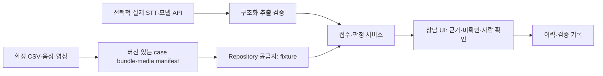

# OneFlow 제품·데이터·인터페이스 설계 v1

목표·범위는 [03](03_목표와_범위.md), 실행 순서는 [TODO](../TODO.md), 검증은 [06](06_검증과_시연.md). 여기의 경로는 앞으로 만들 산출물의 계약입니다. 존재 여부는 작업표와 검증 증거로 확인합니다.

## 1. 사용자 동선과 화면

| 화면 | 입력·동작 | 결과 | 실패·빈 상태 |
|---|---|---|---|
| 상담 접수 `/intake` | 케이스 선택, 합성 음성 재생/텍스트 입력, 접수 초안 생성 | 발화 목록 + 편집 가능한 점포·유형·상품·수량·요청 | 빈 발화는 제출 불가, 미식별 필드는 null·추가 질문 |
| 케이스 작업대 `/cases` | 목록 선택, 근거 새로고침 | 접수 요약 + 원본 행 표 + 영상 + 판단 초안 | loading/empty/error/stale를 구분. 이전 케이스 잔상 금지 |
| 확인·이관 패널 | 사실/미확인 확인, 답변 수정, 이관 대상 선택 | 담당자가 확인한 초안과 이력 저장 | 증거 누락 시 자동 종결 불가. 중복 클릭은 한 번만 저장 |

기본 화면은 목록과 상세를 함께 보여줍니다. 점포·기준일·센터·케이스 상태 필터를 표시하되 새 사례를 열면 케이스의 점포·주문으로 범위를 좁힙니다. 사실은 원본 값, 해석은 제안, 미확인은 추가 확인 대상으로 표기합니다. 색만으로 구분하지 않고 문구·아이콘을 함께 씁니다.

접수 필드 클릭 → 근거 발화 하이라이트, 근거 표 행 클릭 → 원본 테이블·키·값·시각 표시, 영상 클릭 → 해당 토트/차량과 시간 범위 표시. 케이스 전환 시 재생을 멈추고 선택 상태를 초기화합니다. 키보드만으로 접수·저장 가능해야 합니다.

## 2. 시나리오별 판정표

| ID | 관측 | 확정할 수 있는 사실 | 확정하면 안 되는 것 | 다음 조치 |
|---|---|---|---|---|
| CASE-0001 미도착 문의 | 배차 계획 존재, 도착 실적 누락/recorded=false | 계획과 조회 시점의 기록 누락 | 실제 미도착, 기사 귀책, 배송 완료 | 배송 확인 담당자에게 도착 여부 확인 요청 |
| 오출 케이스 | 주문 기대 상품/수량과 출고 상품/수량 비교, 연결된 토트 영상 | 키가 일치하는 출고 기록의 차이 | 고객이 받은 실물 확정, 영상만으로 상품 식별 확정 | 출고 담당 확인 후 회수/재배송 제안 |
| 영상 누락 | 메타데이터 또는 파일 없음 | 영상 조회 불가 | '정상 출고이므로 문제없음' | 원본 행으로 확인하고 영상 추가 확보 |
| 데이터 충돌 | 같은 주문에 서로 다른 기록 | 충돌 존재와 두 출처 | 임의로 한 출처를 정답 채택 | 검토 필요로 잠금 |

오출 케이스 ID는 생성 결과의 `reception_cases.case_type`과 실제 행으로 P02에서 확정합니다. 임의로 CASE-0002라고 하드코딩하지 않습니다.

## 3. 데이터 정본·결합

입력 정본은 별도 킷의 `scripts/gen_fake_data.py`와 생성된 `data/seed/manifest.json`입니다. 킷 SHA·seed·생성 기준일을 bundle에 기록합니다. 합성 22테이블 중 P0 조회에 필요한 테이블만 배포 파일로 변환합니다.

| 단계 | 키·관계 | 검증 |
|---|---|---|
| 통화 → 접수 | `call_logs.call_id = reception_cases.call_id`, `store_id` 보존 | 접수마다 통화 1개, 점포 불일치 차단 |
| 접수 → 근거 | `case_evidence.case_id`, `evidence_table`, `evidence_key` | 테이블 허용 목록, 키 해석을 명시적 resolver로 처리 |
| 발주 → WMS | `purchase_orders.po_id` → `wms_outbound_orders.po_id`, `wo_id` | 점포·센터·배송일과 주문키 함께 대조 |
| 피킹·출고 | `po_id`, `line_no`, `wo_id`, `tote_id` | expected/shipped 상품·수량 비교. 상품명 유사도로 조인 금지 |
| 배차 → 방문 → 실적 | `dispatch_id`, `stop_seq`; 방문의 `store_id`, `wo_id` | 계획과 실적 필드를 분리. null·false·0 구분 |
| 영상 | `clip_id`, `related_tote_id`/`related_vehicle_id`, `start_time`, `end_time` | 토트/차량 + 시간 + 센터 일치 확인, 무관 영상은 제외 |
| 처리 이력 | `case_id`, `history_seq`, `actor_id`, `action`, `event_time` | 케이스별 순서, 중복 저장 방지 |

CSV의 빈 문자열은 필드 정의에 따라 null로 변환합니다. 수량 0은 0으로 남깁니다. 시간은 입력의 시간대 확인 후 ISO 8601 + 명시적 오프셋으로 변환하고 화면은 KST로 표시합니다. 원본 시각이 불명확하면 시간대를 임의로 사실화하지 않고 manifest에 가정을 기록합니다.

## 4. 공통 계약

버전은 `contractVersion: "1.0"`. P02에서 실제 타입·fixture·계약 테스트로 고정합니다. 이 문서의 JSON은 형식 예시이며 실제 관측값이 아닙니다.

```json
{
  "contractVersion": "1.0",
  "caseId": "CASE-0001",
  "mode": "replay",
  "intake": {
    "storeId": null,
    "caseType": "not_arrived",
    "productId": null,
    "quantity": null,
    "requestText": "도착 여부 확인",
    "sources": {"caseType": ["utterance-1"]}
  },
  "evidence": [{
    "id": "evidence-1", "table": "tms_arrival_actual",
    "key": {"dispatch_id": "fixture-defined", "stop_seq": 1},
    "status": "missing", "facts": {"actual_arrival_time": null},
    "observedAt": "2026-09-21T14:00:00+09:00"
  }],
  "decision": {
    "status": "needs_review",
    "confirmedFacts": [], "unknowns": ["실제 도착 여부"],
    "draft": "도착 실적이 확인되지 않아 담당자에게 확인을 요청합니다.",
    "sourceIds": ["evidence-1"], "requiresHuman": true
  }
}
```

- `caseType`: `not_arrived | mispick | damaged | inquiry | unknown`.
- `mode`: `live | replay | manual`. 화면 상단과 내보내기에 항상 남깁니다. 장애로 바뀌면 전환 원인도 표시합니다.
- 근거 `status`: `present | missing | conflicting`. 빈 배열은 근거가 없다는 뜻이며 성공 판정을 뜻하지 않습니다.
- 판단 `status`: `draft | needs_review | ready_for_confirmation | confirmed | handed_off`. 상태 변경은 사람 확인과 이력 기록을 거칩니다.
- 오류 공통: `{code, message, retryable, traceId}`. 민감한 원본 프롬프트·키를 오류 본문에 넣지 않습니다.
- 계약 변경은 메인 승인 후 버전을 바꿉니다. 생산자·소비자 fixture를 같은 커밋에서 갱신합니다.

## 5. 구성과 기술 결정

제품 구현은 **T1 신규 독립 앱**으로 분류합니다. 세부 결정은 [기술 결정카드](../00_설계서/00_기술스택_결정.md)입니다. 기존 킷 정적 HTML은 비교·오프라인 백업으로 보존합니다.



frontend는 Next.js/TypeScript 정적 배포 가능한 구조, backend는 Connexion의 handler → service → repository 경계를 사용합니다. fixture 공급자와 live 공급자는 같은 계약을 반환합니다. P0 시연 데이터는 브라우저 fixture 공급자로도 동작해 백엔드 인증·호스팅 결정의 지연을 분리합니다. API 구현을 확장하면 OpenAPI를 먼저 갱신합니다.

예정 경로: `apps/web/`(UI), `apps/api/`(Python 서비스), `contracts/`(타입·샘플), `data/bundles/`(생성물), `assets/manifest.json`(작은 메타데이터), `tests/eval/`(정답), `reports/`(검증). 실제 생성은 해당 작업 승인 후입니다.

## 6. API·실행 경계

| 작업 | 입력 | 출력·불변 조건 |
|---|---|---|
| `POST /v1/intake/extract` | transcript, source utterances, requestId | 구조화 필드 + source refs. 모델 출력은 타입·참조 검증 후 사용 |
| `GET /v1/cases/{caseId}/evidence` | caseId | 허용된 해당 케이스 근거만. 임의 테이블/SQL 실행 금지 |
| `POST /v1/cases/{caseId}/draft` | confirmed intake + evidence IDs | 사실·미확인·초안 분리. 출처 없는 확정문 거부 |
| `POST /v1/cases/{caseId}/confirm` | version, requestId, human decision | 낡은 version은 충돌, 같은 requestId는 같은 결과 반환 |

P0에서는 이 메서드를 fixture adapter의 함수로 구현해 UI와 계약 테스트를 연결할 수 있습니다. 실제 HTTP 노출과 인증은 P1의 별도 통과 조건입니다. API 요청 제한은 15초 timeout·재시도 최대 1회(조회/추출만), 저장은 requestId로 멱등성을 확인한 뒤 재시도합니다. 모델 호출 예산은 G01에서 금액·건수 상한을 설정하기 전까지 실행하지 않습니다.

## 7. 영상·음성·배포

pc2는 `assets/manifest.json`에 assetId·caseId·clipId·합성 여부·파일명·SHA256·크기·길이·연결 토트/차량·시간 범위·생성 방법을 기록합니다. 파일은 GitHub Release로 전달하고 각 PC는 인증된 `gh release download`로 받습니다.

private GitHub Release의 URL을 브라우저의 공개 영상 URL로 그대로 사용하지 않습니다. 배포 시 허용된 합성 파일만 별도 자산 경로로 옮기고 manifest의 URL을 빌드별로 바꿉니다. Vercel 함수로 대형 영상 파일을 중계하지 않습니다. [Vercel 공식 문서의 요청/응답 크기 제한](https://vercel.com/kb/guide/how-to-bypass-vercel-body-size-limit-serverless-functions)을 배포 전 확인합니다.

브라우저 자동 음성 재생을 전제하지 않고 사용자의 재생 버튼을 제공합니다. Range 재생, 로딩 실패, 파일 누락, 자막 대체를 리허설합니다. 계정 비밀번호·로그인 토큰·API 키는 각 PC에서 인증하고 공유 저장소에 복사하지 않습니다.
